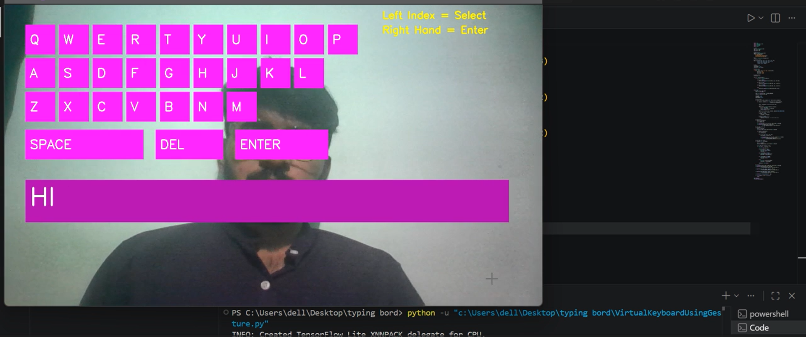

# AirTypingKeyboard
Air Typing Keyboard using Python, OpenCV and MediaPipe. Control a virtual keyboard using hand gestures with left hand selection and right hand confirmation. Includes space, delete, enter and sound feedback.

# Air Typing Keyboard using Python

This project allows you to type without touching a keyboard using hand gestures.

## 🚀 Features
- Left Hand Index Finger = Select Key
- Right Hand = Confirm / Enter
- Virtual Keyboard UI
- Sound Feedback
- Space, Delete, Enter support

## 🛠 Technologies
- Python
- OpenCV
- MediaPipe
- PyAutoGUI

## ▶️ How to Run
1. Install dependencies:
   pip install -r requirements.txt

2. Run the program:
   python AirTypingKeyboard.py

## 🎥Demo
## 🎥 Demo

⭐ If you like this project, give it a star!
